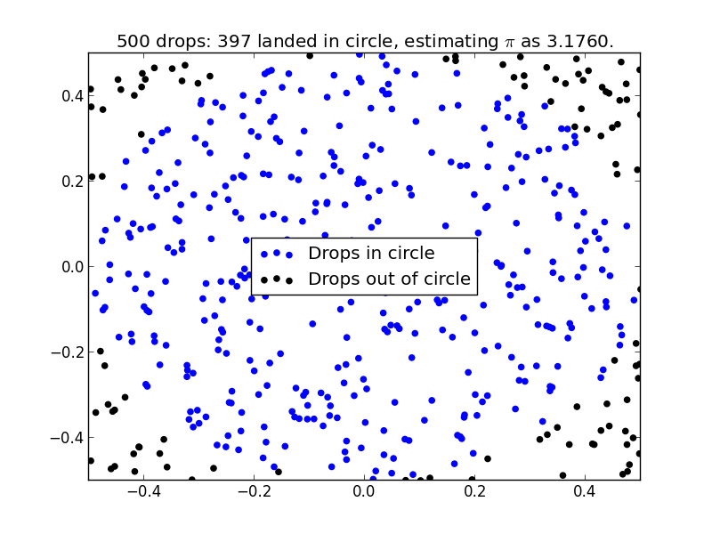
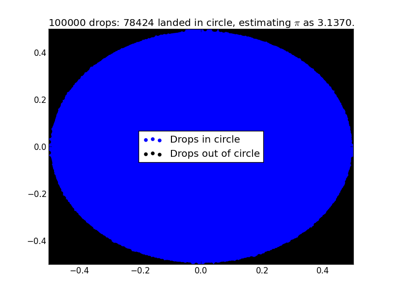
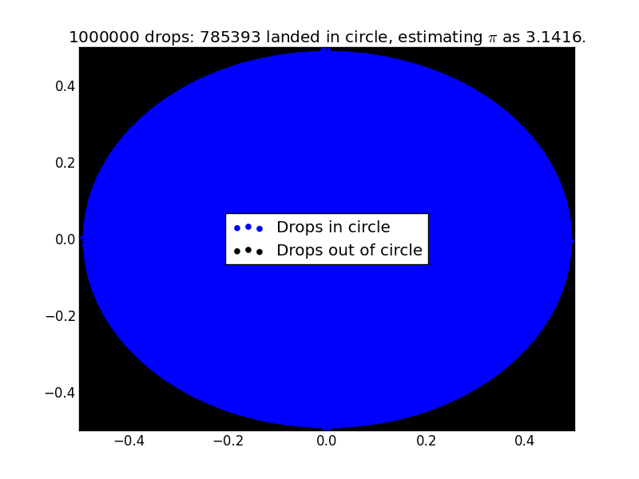

# Making rain fall in a field so as to estimate pi.

This repo contains some code that simulates rain fall in a square field and counts the number of drops that fall in an inscribed circle so as to estimate pi.

## Usage

    python Estimate_pi.py 500

This returns:

    ----------------------
    500 drops
    pi estimated as:
        3.112
    ----------------------

*but* also outputs a plot:

If we have 100,000 drops we get:

If we have 1,000,000 drops we get:

# License Information

This work is licensed under a [Creative Commons Attribution-ShareAlike 3.0](http://creativecommons.org/licenses/by-sa/3.0/us/) license.  You are free to:

* Share: copy, distribute, and transmit the work,
* Remix: adapt the work

Under the following conditions:

* Attribution: You must attribute the work in the manner specified by the author or licensor (but not in any way that suggests that they endorse you or your use of the work).
* Share Alike: If you alter, transform, or build upon this work, you may distribute the resulting work only under the same or similar license to this one.

When attributing this work, please include me (but don't feel obliged to: I'd just be happy to know if anyone made use of it :) ).
